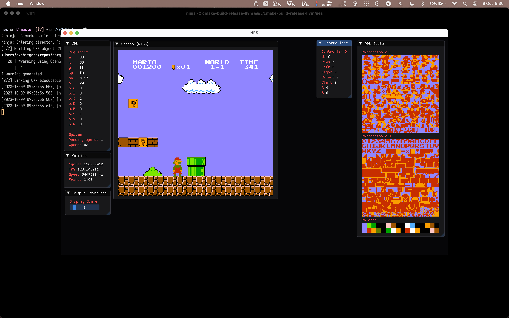

# Yet another NES emulator.



## Why?

It's been quite long since I last wrote an emulator, and I wanted to get into
emulating a classic system.

## Why C++? Isn't it unsafe bla bla?

Well personally, I find C++ to be good while writing emulators. I should
probably try rust or zig, but it is what it is.

## Umm how does it work?

The emulator is divided into several different subsystems,

- **Graphics and GUI subsystem** – The name says it all. I use OpenGL (yes even
  on Apple systems, it is "good enough" for my use-case) along with
  [GLFW](https://github.com/glfw/glfw) and
  [Dear ImGui](https://github.com/ocornut/imgui).

  I have a custom [image class](./src/image.cpp) to send images to the GPU for
  drawing. Other than the image class, and the application entrypoint, nothing
  is coupled to OpenGL, and in theory I can replace it with Vulkan, or even use
  it platform specific implementations for Metal and DirectX in the future.

- **CPU** – The classic MOS 6502 without the decimal mode.

- **Bus** - Technically the whole NES system, as everything comes together here.
  What even is CPU in isolation?

- **PPU** – The picture processing unit of the NES.

- **APU** (WIP) – Audio processing unit. I haven't implemented this yet.

- **Carts and mappers** – The plasic with a PCB inside.

## How to build?

You'll need a couple things installed before you can get going,

- CMake
- Ninja (or `make`)
- Clang (Can probably use GCC but MSVC won't work for sure)
- vcpkg
- XCode on macOS / Visual Studio with the C++ desktop workload on Windows

You can then build it in release mode using

```sh
$ cmake -Bcmake-build-release -DCMAKE_C_COMPILER=clang -DCMAKE_CXX_COMPILER=clang++ -GNinja -DCMAKE_BUILD_TYPE=Release -DCMAKE_TOOLCHAIN_FILE=[path to vcpkg]/scripts/buildsystems/vcpkg.cmake
$ ninja -Ccmake-build-release
```

### What about debug mode?

Well you can build it in debug mode as-well, but keep in mind that it enabled `trace`
level logging which logs ~50 lines per machine cycle, and the machine runs at 5.3MHz.
You run the risk of logging **gigabytes** of logs.

Also, it enables address sanitizer which decreases program speed by a factor of two.
It is recommended to build in release unless you know what you are doing.
